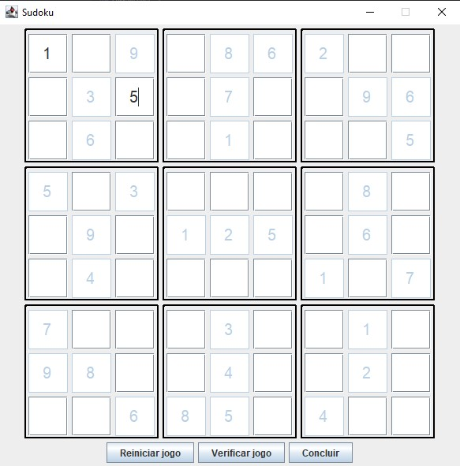
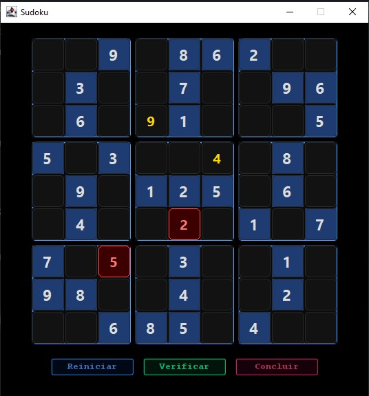

# 🧩 Sudoku Java

> 🎓 Projeto desenvolvido para os seguintes Bootcamps na plataforma [DIO](https://www.dio.me):  
> - **Globant Java & Spring Boot AI Developer**  
> - **Almaviva Solutions Back-end com Java & QA** 
>
> 📌 Desafio: **Criando um Jogo do Sudoku em Java**

Aplicação de Sudoku desenvolvida em **Java** com interface gráfica em **Swing**. O projeto foi aprimorado com foco em UI moderna, experiência do usuário e boas práticas de arquitetura.

---

## 🎯 Objetivo

Este projeto foi criado com o objetivo de praticar:

- Programação orientada a objetos (POO)
- Desenvolvimento de interfaces gráficas com Swing
- Separação de responsabilidades (Model × Service × UI)
- Lógica de validação de jogos
- Customização visual de componentes Java

---

## 🖥️ Demonstração


| Antes | Depois |
|-------|--------|
|  |  |

---

## ✨ Melhorias implementadas

### 🎨 Interface moderna
- Tema dark aplicado
- Paleta de cores mais sofisticada
- Visual inspirado em apps profissionais

### 🔤 Tipografia
- Fonte atualizada para `Segoe UI`
- Números em negrito (bold) para melhor leitura

### 🧩 Componentes customizados
- Bordas arredondadas (`RoundedBorder`)
- Melhor organização visual das células

### 🎯 Experiência do usuário
- Destaque ao focar em células
- Efeito hover com o mouse
- Melhor contraste visual

### 🚫 Validação visual
- Células com valores incorretos ficam vermelhas
- Feedback imediato ao usuário

### 🔒 Regras do jogo
- **Células fixas:** não editáveis, sempre visíveis, estilo diferenciado
- **Células jogáveis:** editáveis, com destaque ao receber foco

---

## 🛠️ Tecnologias utilizadas

- **Java 21**
- **Swing** (GUI)
- **IntelliJ IDEA**

---

## 📁 Estrutura do projeto

```
src/
└── br.com.dio/
    ├── model/
    │   ├── Board.java
    │   ├── GameStatusEnum.java
    │   └── Space.java
    ├── service/
    │   ├── BoardService.java
    │   ├── EventEnum.java
    │   ├── EventListener.java
    │   └── NotifierService.java
    ├── ui/
    │   └── custom/
    │       ├── button/
    │       │   ├── CheckGameStatusButton.java
    │       │   ├── FinishGameButton.java
    │       │   └── ResetButton.java
    │       ├── frame/
    │       │   └── MainFrame.java
    │       ├── input/
    │       │   ├── NumberText.java
    │       │   └── NumberTextLimit.java
    │       ├── panel/
    │       │   ├── MainPanel.java
    │       │   └── SudokuSector.java
    │       └── screen/
    │           ├── MainScreen.java
    │           └── RoundedBorder.java
    ├── util/
    │   └── BoardTemplate.java
    ├── Main.java
    └── UIMain.java
```

---

## ⚙️ Como executar o projeto
 
### 📌 Pré-requisitos
 
- **Java 21** instalado ([Download aqui](https://www.oracle.com/java/technologies/downloads/))
- IDE de sua preferência (recomendado: [IntelliJ IDEA](https://www.jetbrains.com/idea/download/))
### ▶️ Passo a passo
 
**1. Clone o repositório**
```bash
git clone https://github.com/Zenobya/Sudoku_Project_Dio.git
```
 
**2. Abra o projeto na sua IDE**
 
**3. Configure os Program Arguments**
 
Vá em **Run → Edit Configurations** e no campo **Program Arguments** cole o tabuleiro abaixo (já pronto para usar):
 
```
0,0;5,true 0,1;3,true 0,2;0,false 0,3;0,false 0,4;7,true 0,5;0,false 0,6;0,false 0,7;0,false 0,8;0,false 1,0;6,true 1,1;0,false 1,2;0,false 1,3;1,true 1,4;9,true 1,5;5,true 1,6;0,false 1,7;0,false 1,8;0,false 2,0;0,false 2,1;9,true 2,2;8,true 2,3;0,false 2,4;0,false 2,5;0,false 2,6;0,false 2,7;6,true 2,8;0,false 3,0;8,true 3,1;0,false 3,2;0,false 3,3;0,false 3,4;6,true 3,5;0,false 3,6;0,false 3,7;0,false 3,8;3,true 4,0;4,true 4,1;0,false 4,2;0,false 4,3;8,true 4,4;0,false 4,5;3,true 4,6;0,false 4,7;0,false 4,8;1,true 5,0;7,true 5,1;0,false 5,2;0,false 5,3;0,false 5,4;2,true 5,5;0,false 5,6;0,false 5,7;0,false 5,8;6,true 6,0;0,false 6,1;6,true 6,2;0,false 6,3;0,false 6,4;0,false 6,5;0,false 6,6;2,true 6,7;8,true 6,8;0,false 7,0;0,false 7,1;0,false 7,2;0,false 7,3;4,true 7,4;1,true 7,5;9,true 7,6;0,false 7,7;0,false 7,8;5,true 8,0;0,false 8,1;0,false 8,2;0,false 8,3;0,false 8,4;8,true 8,5;0,false 8,6;0,false 8,7;7,true 8,8;9,true
```
 
> 💡 Cada argumento representa uma célula no formato `linha,coluna;valor,fixo`.
> Valores `true` são células fixas (não editáveis). Valores `false` são as casas que você deve preencher.
 
**4. Execute a classe `UIMain`**
 
> ✅ A janela do jogo abrirá automaticamente — sem necessidade de usar o terminal!
 
---

## 🧠 Arquitetura

O projeto segue separação clara de responsabilidades:

| Camada | Classe | Responsabilidade |
|--------|--------|-----------------|
| **Model** | `Space` | Representa cada célula do tabuleiro |
| **Model** | `Board` | Gerencia o estado geral do jogo |
| **Model** | `GameStatusEnum` | Define os estados: `NON_STARTED`, `INCOMPLETE`, `COMPLETE` |
| **Service** | `BoardService` | Lógica de validação e controle do jogo |
| **Service** | `NotifierService` | Comunicação entre componentes via eventos |
| **UI** | `NumberText` | Campo de entrada customizado por célula |
| **UI** | `SudokuSector` | Painel visual de cada bloco 3×3 |
| **UI** | `MainScreen` | Monta e orquestra toda a tela do jogo |

---

## 🏆 Bootcamp

| | |
|--|--|
| **Plataforma** | [DIO — Digital Innovation One](https://www.dio.me) |
| **Bootcamp** | Globant — Java & Spring Boot AI Developer |
| **Desafio** | Criando um Jogo do Sudoku em Java |

---

## 👩‍💻 Autora

Desenvolvido por **Camila Machado** "Zenóbya" ✨

[](https://github.com/Zenobya)
[](https://www.dio.me)
[](https://www.dio.me/bootcamp/globant-java-spring-boot-ai-developer)
